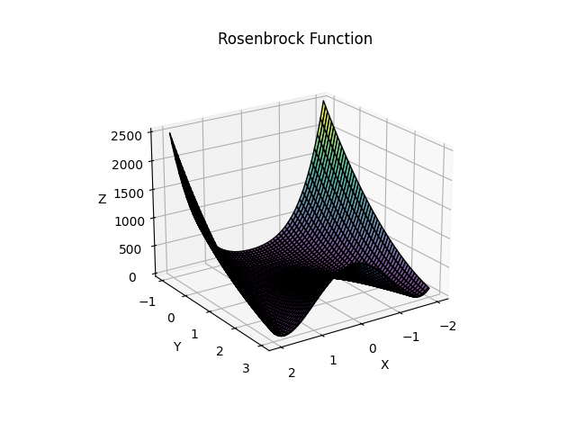

Performance tests on the Artificial Bee Colony algorithm for class INT3103 07 - Optimization.

# Testing method
ABC, GA, ACO is ran 30 times on several continuous functions and discrete problems.<br/>
The runner will calculate the average best_fitness during each iteration of each algorithm, and display them as a line graph.<br/>
For continuous functions, a bar chart is also provided for the final best_fitness value of the three algorithms.<br/>

# Continuous functions
<h2>Sphere function</h2>
A simple convex shape, used to test convergence speed.<br/>
Parameters: -10 < x<sub>i</sub> < 10, n = 2<br/>
<br/>

  
<h2>Rastrigin function</h2>
A parabolic function with cosine waves on all its surface, tests an algorithm’s exploration capability and resilience to local minima traps.<br/>
Parameters: -5.12 < x<sub>i</sub> < 5.12, A = 10<br/>
<br/>


<h2>Rosenbrock function</h2>
A narrow, curved valley leading to the global minimum, test an algorithm's ability to handle non-linear search paths and narrow, curved valleys.<br/>
Parameters: 2 < x<sub>1</sub> < 2, -1 < x<sub>2</sub> < 3, n = 3<br/>
<br/>


<h2>Schaffer function</h2>
The Schaffer function is non-convex and multimodal, with a pattern of ridges and valleys forming concentric rings around the origin, used to test algorithms on high-frequency oscillations and local minima challenges.<br/>
Parameters: -10 < x<sub>1</sub>, x<sub>2</sub> < 10<br/>
<br/>


# Discrete problems
<h2>Knapsack Problem</h2>
Input (https://developers.google.com/optimization/pack/knapsack):<br>
<br>

```python
values = [360, 83, 59, 130, 431, 67, 230, 52, 93, 125, 670, 892, 600, 38, 48, 147, 
          78, 256, 63, 17, 120, 164, 432, 35, 92, 110, 22, 42, 50, 323, 514, 28, 87, 
          73, 78, 15, 26, 78, 210, 36, 85, 189, 274, 43, 33, 10, 19, 389, 276, 312]

weights = [7, 0, 30, 22, 80, 94, 11, 81, 70, 64, 59, 18, 0, 36, 3, 8, 15, 42, 9, 
           0, 42, 47, 52, 32, 26, 48, 55, 6, 29, 84, 2, 4, 18, 56, 7, 29, 93, 44, 
           71, 3, 86, 66, 31, 65, 0, 79, 20, 65, 52, 13]<br>

itemCount = 50
capacities = 850
```

<b>Maxima = 7534</b><br>

<h2>Travelling Salesman Problem</h2>
Input (https://developers.google.com/optimization/routing/tsp):<br>
<br>

```python
data = {}
data["distance_matrix"] = [
    [0, 2451, 713, 1018, 1631, 1374, 2408, 213, 2571, 875, 1420, 2145, 1972],
    [2451, 0, 1745, 1524, 831, 1240, 959, 2596, 403, 1589, 1374, 357, 579],
    [713, 1745, 0, 355, 920, 803, 1737, 851, 1858, 262, 940, 1453, 1260],
    [1018, 1524, 355, 0, 700, 862, 1395, 1123, 1584, 466, 1056, 1280, 987],
    [1631, 831, 920, 700, 0, 663, 1021, 1769, 949, 796, 879, 586, 371],
    [1374, 1240, 803, 862, 663, 0, 1681, 1551, 1765, 547, 225, 887, 999],
    [2408, 959, 1737, 1395, 1021, 1681, 0, 2493, 678, 1724, 1891, 1114, 701],
    [213, 2596, 851, 1123, 1769, 1551, 2493, 0, 2699, 1038, 1605, 2300, 2099],
    [2571, 403, 1858, 1584, 949, 1765, 678, 2699, 0, 1744, 1645, 653, 600],
    [875, 1589, 262, 466, 796, 547, 1724, 1038, 1744, 0, 679, 1272, 1162],
    [1420, 1374, 940, 1056, 879, 225, 1891, 1605, 1645, 679, 0, 1017, 1200],
    [2145, 357, 1453, 1280, 586, 887, 1114, 2300, 653, 1272, 1017, 0, 504],
    [1972, 579, 1260, 987, 371, 999, 701, 2099, 600, 1162, 1200, 504, 0],
]
data["num_vehicles"] = 1
data["depot"] = 0
```

<b>Minima = 7293</b><br>

# Test results
<h2>Continous functions</h2>

<h2>Discrete problems</h2>
<h3>Knapsack</h3>

<h3>TSP</h3>


# Conclusion
The ABC algorithm performed better than the GA and ACO algorithm on continuous functions as implemented here, showing strong speed and precision, as well as possessing a good ability to escape local minima.<br>
<br>
Conversely, it performed worse on discrete problems. In these cases, the GA and ACO algorithms showed comparatively better adaptability, suggesting that while ABC is powerful for continuous optimization, its heuristics may require adjustments for tackling discrete search spaces effectively.<br>
<br>
Overall, this highlights the importance of choosing algorithms based on the specific nature of the problem, as each has unique strengths and weaknesses across different problem domains.<br>
